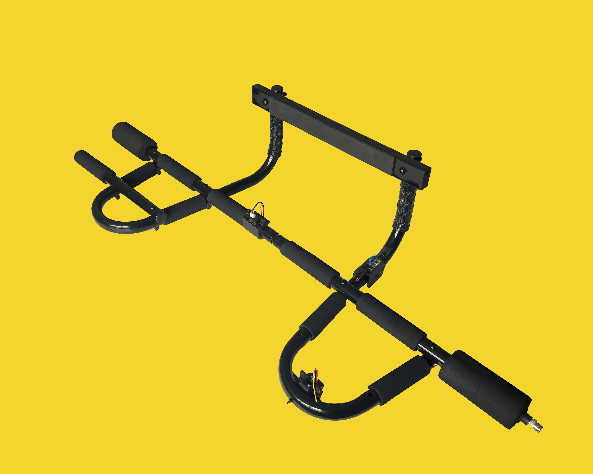

# bodegabar

This repository _will have_ the necessary files to modify a cheap [pull-up bar](https://web.archive.org/web/20230430230727/https://www.amazon.com/gp/product/B002YQUP7Q/ref=ppx_yo_dt_b_search_asin_title?ie=UTF8&th=1) so that it can automatically track your hard workouts, my dude. It logs the data to TBD (most likely a Google Sheet?). The files in the repository include the client code (running on a [Raspberry Pi Pico W](https://www.raspberrypi.com/documentation/microcontrollers/raspberry-pi-pico.html)), the server code (running on a [Raspberry Pi 4](https://www.raspberrypi.com/products/raspberry-pi-4-model-b/)), as well as the 3D models of the parts that need to be 3D printed to enable the modification.
